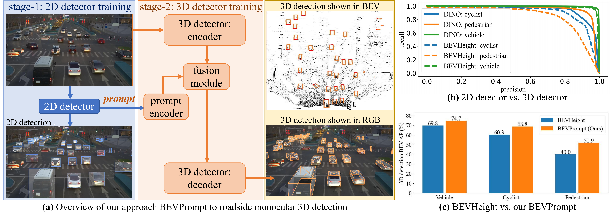

# BEVPrompt


**BEVPromot** is a new vision-based roadside monocular 3D object detector. BEVPrompt surpasses BEVDepth and BEVHeight by a obvious margin of **8.8%**, **13.3** and **18.0%**, **8.5%**, **11.9%** in vehicle, cyclist, pedestrian classes respectively on **DAIR-V2X-I**.


<br>

<!-- TABLE OF CONTENTS -->
<details open="open" style='padding: 10px; border-radius:5px 30px 30px 5px; border-style: solid; border-width: 1px;'>
  <summary>Table of Contents</summary>
  <ol>
    <li>
      <a href="#Getting Started">Getting Started</a>
    </li>
    <li>
      <a href="#Acknowledgment">Acknowledgment</a>
    </li>
  </ol>
</details>

<br/>

# Getting Started

- [Installation](docs/install.md)
- [Prepare Dataset](docs/prepare_dataset.md)

Train BEVHeight with 8 GPUs
```
python [EXP_PATH] --amp_backend native -b 8 --gpus 8
```
Eval BEVHeight with 8 GPUs
```
python [EXP_PATH] --ckpt_path [CKPT_PATH] -e -b 8 --gpus 8
```

# Acknowledgment
This project is not possible without the following codebases.
* [BEVHeight](https://github.com/ADLab-AutoDrive/BEVHeight)
* [BEVDepth](https://github.com/Megvii-BaseDetection/BEVDepth)
* [DAIR-V2X](https://github.com/AIR-THU/DAIR-V2X)
* [Rope3D](https://github.com/liyingying0113/rope3d-dataset-tools)

